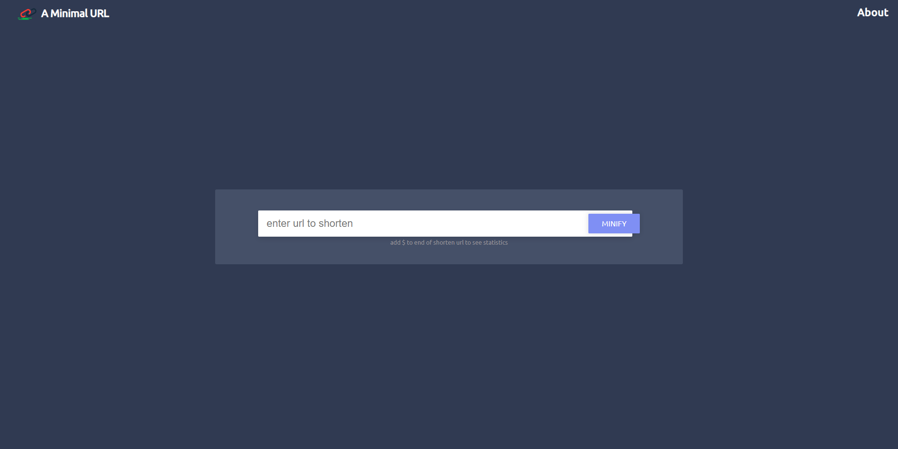

# A Minimal URL

## Live Demo [https://dropurl.netlify.app/](https://dropurl.netlify.app/)

The backend code is present at : [urlshortner/backend](https://github.com/saurabhshalu/url-shortner-backend)



Minimal URL is a very simple URL shortner serivce which let's you convert long URL into smaller ones which are easy to remember and use in presentaion 


## How to contribute

* (Optional but advisable) Create an issue if you find any bug or want to improve something
* Fork the repo
* Clone the repo to your local machine

 
```
git clone http://github.com/<YOUR-USERNAME>/url-shortner-frontend
```

* Install node_modules
```
npm install
```
* Run the project

```
ng serve -o
```
* Make meaningful changes and write a understandable commit message
* Push the changes and create a pull request
